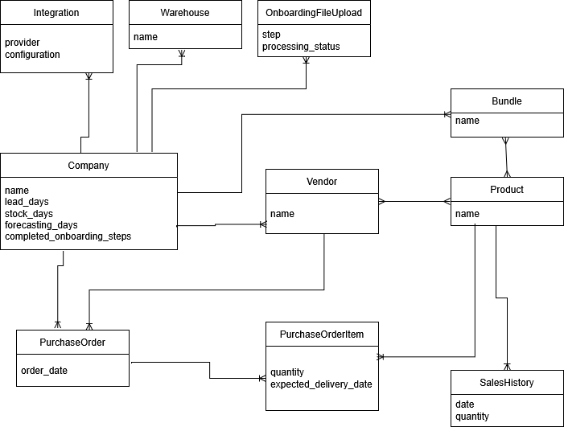

# Requirements

Design backend API for a React frontend, that will allows the user to complete onboarding for his company.

Onboarding steps must satisfy the following:

- we can track which steps have been completed for a company
- we can track which steps have been skipped for a company
- order of steps is defined somewhere
- some steps can only be completed after a condition has been met (e.g. previous step completed or file processing of previous step completed)
- it should be possible to track status of asynchronous jobs so that user can be informed to improve UX

## Onboarding steps

The onboarding consists of several steps, some of which must be completed and some of which can be skipped. Onboarding is considered complete when all mandatory steps have been completed and when all optional steps have been commpleted or skipped.

### 1. Welcome

Only contains welcome text with basic information.

### 2. Set your lead time

User sets the lead time in days. This step must be completed.

### 3. Set days of stock for products

User to sets the days of stock. This step must be completed.

### 4. Set forecasting days

Users sets how far back (in days) should we look when calculating daily average sales of a product. This step must be completed.

### 5. Add vendors

User can add vendors (suppliers) that supply their products. This step was added because later steps (Upload Purchase Orders, Match Suppliers) depend on vendors existing in the system. Without a dedicated step, there would be no clear point in the onboarding flow for the user to enter this data. This step is optional.

### 6. Add products

User can add products they sell. This step was added because the Match Suppliers step requires products to exist in order to create vendor-product associations. This step is optional.

### 7. Upload existing Purchase orders

User can upload excel or csv file with purchase orders. This step is optional. This step is unlocked only after Vendors have been added into the app.

### 8. Match suppliers and products

User can choose, which vendors can be used as suppliers. This step is optional. This step is unlocked only after both Vendors and Products have been added into the app.

### 9. Set bundles

User can upload an excel or csv file, which will be used to import bundles. This step is optional.

### 10. Set integrations

User can add and configure integrations. User selects from a predefined list. Additionaly, use can request a new integration.

# Models

## Entity diagram



## Company

The core model representing the ecommerce platform. Stores company-level configuration such as lead time, stock days, and forecasting days. All onboarding step metadata — names, order, mandatory flag, and file upload requirements — is defined in a single `ONBOARDING_STEP_CONFIG` hash on this model. This serves as the single source of truth, consumed by both the onboarding status endpoint and individual step controllers. Completion status is tracked via the `OnboardingStep` model.

## OnboardingStep

Tracks the status of each onboarding step for a company. Uses integer enums for both the step identifier and its status (pending, completed, or skipped).

## Integration

Represents third-party integrations of the company. The one-to-many relationship assumes that each company cannot integrate more than once with the same provider. The configuration is JSON to allow us to store any format needed, as different integrations might need to store different kinds of data. As I don't presume there would be any filtering or sorting based on this attribute, it should be fine to simply store it as a JSON attribute.

## Warehouse

Not further specified in the UI, so I just left it with a simple name and association to company.

## PurchaseOrder

Assuming this acts more or less as an invoice with several products on it. For our purposes, the date of the order seemed the only important attribute, as by comparing it to the delivery date, it would help us understand how long it usually takes for a product to be delivered after being ordered. Maybe adding another identifer which can be imported would also be useful.

## PurchaseOrderItem

Tells us how many products were ordered and when they are expected to be delivered.

## Bundle

My understanding is that a bundle consists of multiple products that are being sold as one. Belongs to a company, as bundles are company-specific groupings.

## Product

Represents the actual items being sold. Belongs to a company, as products are managed per company. I added a many-to-many relationship to vendors, as I can imagine that it might be possible that some products can be ordered from multiple vendors. When starting, I would also consider starting with a simple one-to-many relationship and switching to many-to-many later.

## SalesHistory

Used to track quantity of products sold, useful for predicting when the item will need to be restocked again.

## Vendor

My understanding is that a vendor is meant as a supplier who can supply specific products.

## OnboardingFileUpload

Used to store files uploaded during onboarding, so that they can be processed in the background (assuming that files can get big enough that processing them synchronously would take too long). File size is limited to 10 MB. Files are uploaded via a single dedicated endpoint (`POST /api/v1/onboarding/file_uploads`), which validates content type and size, and enqueues the appropriate background job. Onboarding steps that require file uploads can only be completed after a file has been uploaded for that step, keeping the step controllers focused solely on marking completion. An `error_message` text field stores actionable feedback when processing fails, so the frontend can display what went wrong to the user.

## IntegrationRequest

Allows users to request integrations that are not yet available in the predefined list. Stores the requested integration name and an optional description. Belongs to a company.

# Background Jobs

The application uses **SolidQueue** as its Active Job queue adapter. SolidQueue was chosen because it uses the existing database for job storage, avoiding the need for a separate Redis dependency.

## Import Jobs

File uploads during onboarding are processed asynchronously via two background jobs:

- **PurchaseOrderImportJob** — Enqueued when a file is uploaded for the `upload_pos` step. Parses the uploaded CSV/Excel file and creates `PurchaseOrder` and `PurchaseOrderItem` records. Updates the associated `OnboardingFileUpload` processing status to `completed` or `failed`.
- **BundleImportJob** — Enqueued when a file is uploaded for the `bundles` step. Parses the uploaded CSV/Excel file and creates `Bundle` records. Updates the associated `OnboardingFileUpload` processing status to `completed` or `failed`.

Both jobs are dispatched from the file uploads controller (`POST /api/v1/onboarding/file_uploads`) immediately after the file is persisted. The `OnboardingFileUpload` record's `processing_status` field allows the frontend to poll for completion via `GET /api/v1/onboarding/file_uploads/:id`.

---

## Notes

- I only added minimum attributes needed to satisfy the requirements. I assume that in real life there would be many more.
- For each model, I would also add `created_at` and `updated_at` timestamps, as they are useful in many ways and do not cost much to store.

# Testing

The project uses **RSpec** (`rspec-rails`) for testing. Tests are request specs covering all API endpoints (happy path). Run with `bundle exec rspec`.

# REST API

All endpoints are under `/api/v1`. The company is currently resolved automatically (will be derived from authenticated user in the future).

## Onboarding Status

### `GET /api/v1/onboarding`

Returns the current onboarding progress for the company, including all steps and their statuses. The top-level `completed` flag is `true` when all mandatory steps are completed **and** all optional steps are either completed or skipped. This means a user cannot finish onboarding by only completing mandatory steps — optional steps must be explicitly resolved (completed or skipped).

The API intentionally does not include a `current_step` field. Navigation — including determining which step to show when the user returns — is the frontend's responsibility. The response provides all the information needed: each step's `status`, `locked` flag, and `position`. The recommended client-side algorithm for selecting the default step on load is: pick the first step by `position` where `status` is `pending` and `locked` is `false`. If no such step exists, onboarding is either complete or fully blocked. This keeps navigation logic in the UI layer where it belongs, avoids encoding assumptions about user intent in the API, and allows different clients to tailor the experience (e.g. a mobile app might also persist the last-viewed step in local storage for instant resume).

**Params:** none

**Request:**

```
GET /api/v1/onboarding
```

**Response:**

```json
{
  "company": {
    "id": 1,
    "name": "Acme Corp",
    "lead_days": 7,
    "stock_days": 30,
    "forecasting_days": 90
  },
  "onboarding": {
    "completed": false,
    "steps": [
      {
        "name": "welcome",
        "position": 0,
        "status": "completed",
        "mandatory": false,
        "locked": false,
        "lock_reason": null,
        "unlock_steps": null
      },
      {
        "name": "lead_time",
        "position": 1,
        "status": "pending",
        "mandatory": true,
        "locked": false,
        "lock_reason": null,
        "unlock_steps": null
      },
      {
        "name": "upload_pos",
        "position": 6,
        "status": "pending",
        "mandatory": false,
        "locked": true,
        "lock_reason": "Complete 'Add Vendors' to unlock this step",
        "unlock_steps": [{ "name": "add_vendors", "status": "pending" }],
        "file_upload": null
      },
      {
        "name": "bundles",
        "position": 8,
        "status": "pending",
        "mandatory": false,
        "locked": false,
        "lock_reason": null,
        "unlock_steps": null,
        "file_upload": {
          "id": 1,
          "processing_status": "completed",
          "error_message": null,
          "created_at": "2026-03-16T10:00:00Z"
        }
      }
    ]
  }
}
```

## Onboarding Step Endpoints

Each step has a `PATCH` endpoint to complete it, optional steps also have a `PATCH .../skip` endpoint, and all steps have a `PATCH .../reopen` endpoint to reset them back to pending. All step completion responses follow the same format.

### `PATCH /api/v1/onboarding/welcome`

Marks the welcome step as completed.

**Params:** none

**Request:**

```
PATCH /api/v1/onboarding/welcome
```

**Response:**

```json
{
  "step": { "name": "welcome", "status": "completed" },
  "company": {
    "id": 1,
    "name": "Acme Corp",
    "lead_days": null,
    "stock_days": null,
    "forecasting_days": null
  }
}
```

### `PATCH /api/v1/onboarding/lead_time`

Sets the company's lead time and completes the step. Mandatory. Returns a validation error if `lead_days` is missing or not a positive integer.

**Params:** `lead_days` (positive integer, required)

**Request:**

```json
PATCH /api/v1/onboarding/lead_time
{ "lead_days": 7 }
```

**Response:**

```json
{
  "step": { "name": "lead_time", "status": "completed" },
  "company": {
    "id": 1,
    "name": "Acme Corp",
    "lead_days": 7,
    "stock_days": null,
    "forecasting_days": null
  }
}
```

### `PATCH /api/v1/onboarding/stock_days`

Sets the company's days of stock and completes the step. Mandatory. Returns a validation error if `stock_days` is missing or not a positive integer.

**Params:** `stock_days` (positive integer, required)

**Request:**

```json
PATCH /api/v1/onboarding/stock_days
{ "stock_days": 30 }
```

**Response:**

```json
{
  "step": { "name": "stock_days", "status": "completed" },
  "company": {
    "id": 1,
    "name": "Acme Corp",
    "lead_days": 7,
    "stock_days": 30,
    "forecasting_days": null
  }
}
```

### `PATCH /api/v1/onboarding/forecasting_period`

Sets the company's forecasting period and completes the step. Mandatory. Returns a validation error if `forecasting_days` is missing or not a positive integer.

**Params:** `forecasting_days` (positive integer, required)

**Request:**

```json
PATCH /api/v1/onboarding/forecasting_period
{ "forecasting_days": 90 }
```

**Response:**

```json
{
  "step": { "name": "forecasting_period", "status": "completed" },
  "company": {
    "id": 1,
    "name": "Acme Corp",
    "lead_days": 7,
    "stock_days": 30,
    "forecasting_days": 90
  }
}
```

### `PATCH /api/v1/onboarding/add_vendors`

Marks the add vendors step as completed.

**Params:** none

**Request:**

```
PATCH /api/v1/onboarding/add_vendors
```

**Response:**

```json
{
  "step": { "name": "add_vendors", "status": "completed" },
  "company": {
    "id": 1,
    "name": "Acme Corp",
    "lead_days": 7,
    "stock_days": 30,
    "forecasting_days": 90
  }
}
```

### `PATCH /api/v1/onboarding/add_products`

Marks the add products step as completed.

**Params:** none

### `PATCH /api/v1/onboarding/upload_pos`

Marks the upload purchase orders step as completed. This step is locked until vendors have been added. A file must have been uploaded via `POST /api/v1/onboarding/file_uploads` (with `step=upload_pos`) before this step can be completed.

**Params:** none

**Request:**

```
PATCH /api/v1/onboarding/upload_pos
```

**Response:**

```json
{
  "step": { "name": "upload_pos", "status": "completed" },
  "company": {
    "id": 1,
    "name": "Acme Corp",
    "lead_days": 7,
    "stock_days": 30,
    "forecasting_days": 90
  }
}
```

**Error when locked:**

```json
{
  "error": "Step is locked",
  "lock_reason": "Complete 'Add Vendors' to unlock this step"
}
```

**Error when no file uploaded:**

```json
{
  "error": "File must be uploaded before completing this step. Use POST /api/v1/onboarding/file_uploads to upload."
}
```

### `PATCH /api/v1/onboarding/match_suppliers`

Marks the match suppliers step as completed. This step is locked until both vendors and products have been added. Vendor-to-product assignments are handled separately via `PATCH /api/v1/products/assign_vendors`, keeping the onboarding controller responsible only for step completion. Before allowing completion, the endpoint validates that at least one product has a vendor assigned — this prevents the user from marking the step as done without actually performing any matching.

**Params:** none

**Request:**

```
PATCH /api/v1/onboarding/match_suppliers
```

**Response:**

```json
{
  "step": { "name": "match_suppliers", "status": "completed" },
  "company": {
    "id": 1,
    "name": "Acme Corp",
    "lead_days": 7,
    "stock_days": 30,
    "forecasting_days": 90
  }
}
```

**Error when locked:**

```json
{
  "error": "Step is locked",
  "lock_reason": "Complete 'Add Vendors' and 'Add Products' to unlock this step"
}
```

**Error when no assignments exist:**

```json
{
  "error": "At least one product must have a vendor assigned. Use PATCH /api/v1/products/assign_vendors to assign vendors to products."
}
```

### `PATCH /api/v1/onboarding/bundles`

Marks the bundles step as completed. A file must have been uploaded via `POST /api/v1/onboarding/file_uploads` (with `step=bundles`) before this step can be completed.

**Params:** none

**Request:**

```
PATCH /api/v1/onboarding/bundles
```

**Response:**

```json
{
  "step": { "name": "bundles", "status": "completed" },
  "company": {
    "id": 1,
    "name": "Acme Corp",
    "lead_days": 7,
    "stock_days": 30,
    "forecasting_days": 90
  }
}
```

**Error when no file uploaded:**

```json
{
  "error": "File must be uploaded before completing this step. Use POST /api/v1/onboarding/file_uploads to upload."
}
```

### `PATCH /api/v1/onboarding/set_integrations`

Marks the integrations step as completed.

**Params:** none

### Skip endpoints

All optional steps support `PATCH /api/v1/onboarding/{step_name}/skip`. Available for: `add_vendors`, `add_products`, `upload_pos`, `match_suppliers`, `bundles`, `set_integrations`. Mandatory steps (`lead_time`, `stock_days`, `forecasting_period`) return an error when skip is attempted. The welcome step does not have a skip endpoint — completing and skipping a display-only step are semantically identical, so only the complete endpoint is provided.

Locked steps can be skipped without unlocking them first. The lock mechanism only prevents _completing_ a step (i.e. confirming the data was entered), not skipping it. This allows users to bypass steps they don't need without being forced to complete prerequisites they don't intend to use.

### Reopen endpoints

All steps support `PATCH /api/v1/onboarding/{step_name}/reopen`. This resets a completed or skipped step back to pending, allowing the user to re-do or reconsider it. For data steps (lead_time, stock_days, forecasting_period), reopening does not clear the previously saved company attribute — the user can then re-submit with a new value via the regular complete endpoint. Returns an error if the step is already pending.

**Request:**

```
PATCH /api/v1/onboarding/lead_time/reopen
```

**Response:**

```json
{
  "step": { "name": "lead_time", "status": "pending" },
  "company": {
    "id": 1,
    "name": "Acme Corp",
    "lead_days": 7,
    "stock_days": 30,
    "forecasting_days": 90
  }
}
```

**Error when step is already pending:**

```json
{
  "error": "Step is not completed or skipped"
}

## File Uploads

### `POST /api/v1/onboarding/file_uploads`

Uploads a file for a specific onboarding step (purchase orders or bundles). This is the single endpoint for all onboarding file uploads. Validates file presence, content type (CSV, XLS, XLSX), and file size (max 10 MB). After a successful upload, a background job is enqueued to process the file (`PurchaseOrderImportJob` for `upload_pos`, `BundleImportJob` for `bundles`). The corresponding onboarding step can only be marked as completed after a file has been uploaded through this endpoint. If a file has already been uploaded for the given step, the previous upload is replaced — allowing the user to re-upload before marking the step as done.

**Params:** `step` (string, required — one of: `upload_pos`, `bundles`), `file` (file, required — CSV, XLS, or XLSX, max 10 MB)

**Request:**

```

POST /api/v1/onboarding/file_uploads
Content-Type: multipart/form-data
step=upload_pos&file=<uploaded_file>

````

**Response (201):**

```json
{
  "file_upload": {
    "id": 1,
    "step": "upload_pos",
    "processing_status": "pending",
    "error_message": null,
    "created_at": "2026-03-16T10:00:00Z"
  }
}
````

**Error when file missing:**

```json
{ "error": "File is required" }
```

**Error when invalid file type:**

```json
{ "error": "Invalid file type. Allowed types: CSV, XLS, XLSX" }
```

**Error when file too large:**

```json
{ "error": "File is too large (maximum is 10 MB)" }
```

### `GET /api/v1/onboarding/file_uploads/:id`

Returns the status of a previously uploaded file (useful for polling processing status).

**Params:** `id` (integer, required — in URL)

**Request:**

```
GET /api/v1/onboarding/file_uploads/1
```

**Response:**

```json
{
  "file_upload": {
    "id": 1,
    "step": "upload_pos",
    "processing_status": "pending",
    "error_message": null,
    "created_at": "2026-03-16T10:00:00Z"
  }
}
```

## Vendors

### `GET /api/v1/vendors`

Returns all vendors for the company with their associated product IDs.

**Params:** none

**Request:**

```
GET /api/v1/vendors
```

**Response:**

```json
{
  "vendors": [
    { "id": 1, "name": "Supplier A", "product_ids": [1, 3, 5] },
    { "id": 2, "name": "Supplier B", "product_ids": [2, 4] }
  ]
}
```

### `GET /api/v1/vendors/:id`

Returns a single vendor with its associated product IDs.

**Params:** `id` (integer, required — in URL)

**Request:**

```
GET /api/v1/vendors/1
```

**Response:**

```json
{
  "vendor": { "id": 1, "name": "Supplier A", "product_ids": [1, 3, 5] }
}
```

### `POST /api/v1/vendors`

Creates a new vendor for the company.

**Params:** `vendor[name]` (string, required)

**Request:**

```json
POST /api/v1/vendors
{ "vendor": { "name": "Supplier A" } }
```

**Response (201):**

```json
{
  "vendor": { "id": 1, "name": "Supplier A", "product_ids": [] }
}
```

### `PATCH /api/v1/vendors/:id`

Updates a vendor's name.

**Params:** `id` (integer, required — in URL), `vendor[name]` (string, required)

**Request:**

```json
PATCH /api/v1/vendors/1
{ "vendor": { "name": "Updated Supplier A" } }
```

**Response:**

```json
{
  "vendor": { "id": 1, "name": "Updated Supplier A", "product_ids": [1, 3, 5] }
}
```

### `DELETE /api/v1/vendors/:id`

Removes a vendor and its associated product links.

**Params:** `id` (integer, required — in URL)

**Request:**

```
DELETE /api/v1/vendors/1
```

**Response:** `204 No Content`

## Products

### `GET /api/v1/products`

Returns all products for the company with their associated vendor IDs.

**Params:** none

**Request:**

```
GET /api/v1/products
```

**Response:**

```json
{
  "products": [
    { "id": 1, "name": "Widget", "vendor_ids": [1, 2] },
    { "id": 2, "name": "Gadget", "vendor_ids": [3] }
  ]
}
```

### `GET /api/v1/products/:id`

Returns a single product with its associated vendor IDs.

**Params:** `id` (integer, required — in URL)

**Request:**

```
GET /api/v1/products/1
```

**Response:**

```json
{
  "product": { "id": 1, "name": "Widget", "vendor_ids": [1, 2] }
}
```

### `POST /api/v1/products`

Creates a new product for the company.

**Params:** `product[name]` (string, required)

**Request:**

```json
POST /api/v1/products
{ "product": { "name": "Widget" } }
```

**Response (201):**

```json
{
  "product": { "id": 1, "name": "Widget", "vendor_ids": [] }
}
```

### `PATCH /api/v1/products/:id`

Updates a product's name.

**Params:** `id` (integer, required — in URL), `product[name]` (string, required)

**Request:**

```json
PATCH /api/v1/products/1
{ "product": { "name": "Updated Widget" } }
```

**Response:**

```json
{
  "product": { "id": 1, "name": "Updated Widget", "vendor_ids": [1, 2] }
}
```

### `DELETE /api/v1/products/:id`

Removes a product and its associated vendor/bundle links.

**Params:** `id` (integer, required — in URL)

**Request:**

```
DELETE /api/v1/products/1
```

**Response:** `204 No Content`

### `PATCH /api/v1/products/assign_vendors`

Bulk assigns vendors to products. Validates that all vendor IDs belong to the company.

**Params:** `assignments` (array, required) — each element: `{ product_id, vendor_ids }`

**Request:**

```json
PATCH /api/v1/products/assign_vendors
{
  "assignments": [
    { "product_id": 1, "vendor_ids": [1, 2] },
    { "product_id": 2, "vendor_ids": [3] }
  ]
}
```

**Response:**

```json
{
  "products": [
    { "id": 1, "name": "Widget", "vendor_ids": [1, 2] },
    { "id": 2, "name": "Gadget", "vendor_ids": [3] }
  ]
}
```

## Integrations

### `GET /api/v1/integrations`

Returns all configured integrations and the list of providers still available to add.

**Params:** none

**Request:**

```
GET /api/v1/integrations
```

**Response:**

```json
{
  "integrations": [
    { "id": 1, "provider": "shopify", "configuration": { "api_key": "abc123" } }
  ],
  "available_providers": ["woocommerce", "magento"]
}
```

### `POST /api/v1/integrations`

Creates a new integration for the company.

**Params:** `integration[provider]` (string, required), `integration[configuration]` (object, optional)

**Request:**

```json
POST /api/v1/integrations
{ "integration": { "provider": "shopify", "configuration": { "api_key": "abc123" } } }
```

**Response (201):**

```json
{
  "integration": {
    "id": 1,
    "provider": "shopify",
    "configuration": { "api_key": "abc123" }
  }
}
```

### `PATCH /api/v1/integrations/:id`

Updates an existing integration's configuration.

**Params:** `id` (integer, required — in URL), `integration[provider]` (string), `integration[configuration]` (object)

**Request:**

```json
PATCH /api/v1/integrations/1
{ "integration": { "configuration": { "api_key": "new_key" } } }
```

**Response:**

```json
{
  "integration": {
    "id": 1,
    "provider": "shopify",
    "configuration": { "api_key": "new_key" }
  }
}
```

### `DELETE /api/v1/integrations/:id`

Removes an integration.

**Params:** `id` (integer, required — in URL)

**Request:**

```
DELETE /api/v1/integrations/1
```

**Response:** `204 No Content`

## Integration Requests

### `GET /api/v1/integration_requests`

Returns all integration requests submitted by the company.

**Params:** none

**Request:**

```
GET /api/v1/integration_requests
```

**Response:**

```json
{
  "integration_requests": [
    {
      "id": 1,
      "name": "SAP",
      "description": "Need SAP integration for inventory sync",
      "created_at": "2026-03-16T10:00:00Z"
    }
  ]
}
```

### `POST /api/v1/integration_requests`

Submits a request for an integration that is not yet available.

**Params:** `integration_request[name]` (string, required), `integration_request[description]` (string, optional)

**Request:**

```json
POST /api/v1/integration_requests
{ "integration_request": { "name": "SAP", "description": "Need SAP integration for inventory sync" } }
```

**Response (201):**

```json
{
  "integration_request": {
    "id": 1,
    "name": "SAP",
    "description": "Need SAP integration for inventory sync",
    "created_at": "2026-03-16T10:00:00Z"
  }
}
```
